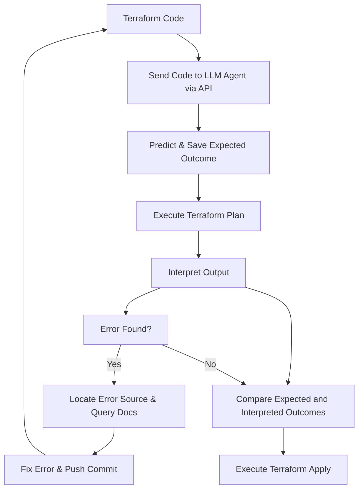

# Title: Enhancing Programming with AI: A Practical Example with Terraform

## Introduction:

In the modern era of software development, artificial intelligence (AI) is playing an increasingly significant role in making the coding process more efficient and less error-prone. AI-powered Language Models (LLMs) can now assist developers in various tasks, from validating code to fixing it before deployment. In this blog post, we will explore an example of using LLM agents to streamline the process.

Let's look at a simple example of working with Terraform code.

## Example: Dynamically applying fixes to Terraform Code with LLM Agents

Here's how LLM agents can assist in creating infrastructure with Terraform:

1. **Sending the code to the LLM agent:** First, the LLM agent is sent a copy of the Terraform code via an API. The agent then predicts what to expect from the code execution and saves the expected outcome.

2. **Executing terraform plan:** The LLM agent runs the 'terraform plan' command, which generates an execution plan detailing the changes to be made to the infrastructure. The output of this command is sent back to the LLM agent for interpretation.

3. **Interpreting the output:** Based on the output received from 'terraform plan', the LLM agent takes one of the following actions:

    a) **If there's an error:**
        - The LLM agent locates the source of the error and queries the documentation for the specific resource/s involved.
        - It then makes an attempt to fix the error and pushes a commit to back to the repository with the updated code, starting the process over.

    b) **If there's no error:**
        - The LLM agent compares the expected outcome it saved earlier with the interpreted outcome of the 'terraform plan' command.
        - If the two outcomes roughly match, the LLM agent can proceed to execute the 'terraform apply' command, deploying the infrastructure changes as planned.

Here is the process visualized:

