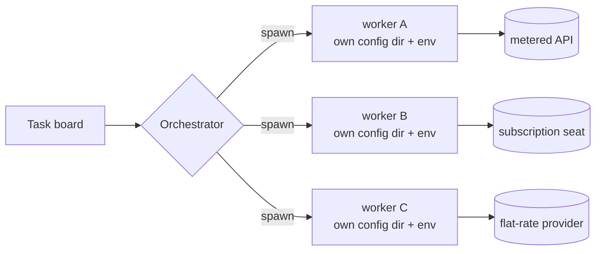

I have seven coding agents running on the Linux box under my desk. They pick tickets off a board, write code, review each other, and file follow-up work when they get stuck.

Four times now I've designed a piece of that setup, built it, and then thrown it away for something dumber that worked better.

## You can't proxy a subscription seat

I have five places to send inference: a couple of metered cloud endpoints, two coding-assistant subscription seats, a flat-rate provider, and a big-context vendor tool. The obvious move is a gateway in front of all of them. One endpoint, one place for keys, one router deciding which model gets a request. It's a solved problem, there's off-the-shelf software for exactly this, and I had it half built.

It doesn't work, and the reason isn't technical. A coding-assistant subscription seat is licensed to you, sitting at a client, doing your own work. Put a gateway credential in the session and the seat is invalidated for that session. The credential that makes the router work is the credential that turns the seat off. So the two cheapest lanes I had were precisely the two that couldn't sit behind the router.

What replaced it is one process per worker. Each agent is its own process, with its own config directory, its own environment block, its own credentials. Nothing shares state at runtime. The orchestrator doesn't route a *model*, it picks an *agent* and spawns it with that agent's environment.

I sulked about this for a week. A gateway gives you one metrics surface, one retry policy, one place to swap a model id. Process isolation gives you seven of everything, and every provider's quirks leak into the orchestration layer instead of being flattened by a shim.

Then it started paying for things I hadn't asked for. A worker that wedges takes nothing else down. A provider outage costs me one lane instead of the router. Credentials for different contexts genuinely can't bleed into each other, because there's no process in which both exist. And "which agent ran this" is an inspectable fact rather than a routing decision buried in a proxy log.

The abstraction I wanted would have hidden the thing I most needed to see.

## A cost ladder beats a smart router

The second thing I wanted was a clever dispatcher. Classify the ticket, estimate the difficulty, pick the right model. I wrote a version of it. It was worse than a list sorted by price.

What I run now is that list, written down in plain language instead of inferred. Cheap flat-rate models take lookups, status checks, read-this-and-tell-me-what-it-says, and bulk drafting. Mid-tier models take feature work and refactors, which is most tickets by volume. The expensive model is reserved for planning, review, and judging another agent's output. Anything recurring and scheduled is pinned to the mid tier, because a nightly job on the top tier is how you find out what your budget looks like when nobody's watching.

The number I actually track is the share of *finished* work the expensive lane touched over a trailing week. I want it under 15%. That one number did more for the system than the classifier ever did, and it's hard to game, because the work has to finish before it counts.

The trouble with a smart router is that it's smart in a way you can't audit. When it makes a bad call you get a debate about the heuristic. With a ladder you get a much better question: this ticket went to the top tier, should it have? A human answers that in five seconds.

## Concurrency needs a write contract, not locks

Several agents write notes into one shared knowledge directory. What a lane learned, why a decision went the way it did, what broke last Tuesday. This is exactly the shape of problem that makes people reach for a database, or a lock service, or a queue with a single writer on the end of it.

The rule I ended up with is one sentence: each writer owns exactly one subdirectory, and writes only there. A lint script reads the diff before it lands and rejects anything that touches a directory the author doesn't own. That's maybe ten lines of shell. It's enforced at the diff, where enforcement is cheap, rather than at runtime, where it would need coordination.

Every write conflict I was bracing for just stopped being possible. Two agents can't collide because their write sets are disjoint by construction, and the check that proves it is the same check a human would run by hand.

Shared material still exists. It gets there by a promotion pass on a schedule, done deliberately by one process, instead of by concurrent writers negotiating. I had been ready to build a coordination layer for that too.

## Questions go up the ladder, not to me

This one took me longest to see. Early on, an agent that hit a judgment call it couldn't settle would stop and ask me. That's polite, and it's also how you become the bottleneck in your own automation. I'd come back to four stopped tickets, each waiting on a question I could have answered in a sentence.

Now an unsure agent hands the question upward, to a more capable agent in the same context, and the handoff has to carry a recommendation. Not "what should I do", but "here are the two readings, here's what each implies, here's what I already ruled out, here's what I'd do." Forwarding a question isn't escalating. Escalating means you did the work and want a decision.

The top tier is expected to decide. If it's a genuine coin flip it picks one, says why, and writes the decision down (which is more than I manage most days).

Four things still reach me: money, credentials, irreversible actions outside this machine, and preferences that have no technical answer. Everything else gets settled inside the swarm. Even the things that do reach me arrive with the default the agent will proceed on if I say nothing, so my silence is a decision rather than a stall.

None of these four are clever. I only found out they were load-bearing by trying to remove them.
