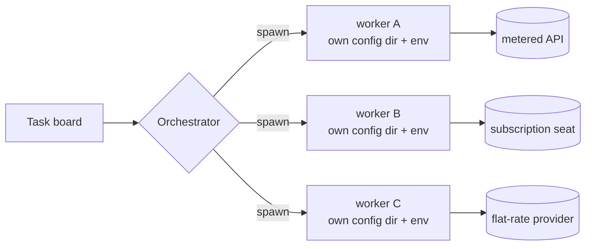

I have seven coding agents running on one Linux workstation under my desk. They pick up tickets off a board, write code, review each other, and file follow-up work when they get stuck. It has been running long enough that I no longer find it novel, which is the point at which it becomes worth writing about.

The interesting part is not that agents can do work. Everybody has seen that by now. The interesting part is the constraints — the four or five things I assumed were implementation details, which turned out to be the actual architecture. Every one of them pushed back on a design I thought was obviously correct.

## You cannot proxy a subscription seat

Here is where I started. Five different inference sources: a couple of metered cloud endpoints, two coding-assistant subscription seats, a flat-rate provider, and a big-context vendor tool. The obvious move is to put a gateway in front of all of them. One OpenAI-shaped endpoint, one place for keys, one router deciding which model gets a request. This is a solved problem; there is off-the-shelf software for exactly this.

It does not work, and the reason is contractual rather than technical. A coding-assistant subscription seat is licensed for you, sitting at a client, doing your work. Route it through a gateway and it is invalidated for that session. The credential that makes the gateway work is the credential that turns the seat off. So the two cheapest and most capable lanes I had were precisely the two that could not sit behind the router.

What replaced it is dumber and works: process-per-worker. Each agent is its own process, with its own config directory, its own environment block, its own credentials. Nothing shares state at runtime. The orchestrator does not route a *model* — it chooses an *agent*, spawns it with that agent's environment, and lets it be whatever it is.

I resented this for about a week. A gateway gives you one metrics surface, one retry policy, one place to swap a model id. Process isolation gives you seven of everything, and every provider's quirks leak into your orchestration layer instead of being flattened by a shim.

Then the isolation started paying for itself in ways I had not asked for. A worker that wedges takes nothing else down. A provider outage removes one lane instead of the router. Credentials for different contexts genuinely cannot bleed into each other, because there is no process in which both exist. And "which agent ran this" is a real, inspectable fact rather than a routing decision buried in a proxy log. The abstraction I wanted would have hidden the thing I most needed to see.

## A cost ladder beats a smart router

The second thing I wanted was a clever dispatcher: classify the task, estimate difficulty, pick the right model. I wrote a version of it. It was worse than a list sorted by price.

What I run now is a ladder, and it is written down in plain language rather than inferred. Cheap flat-rate models take lookups, status checks, "read this and tell me what it says", and bulk drafting. Mid-tier models take feature work and refactors — the great majority of tickets by volume. The expensive model is reserved for three things: planning, review, and judging another agent's output. Anything recurring and scheduled is pinned to the mid tier by default, because a nightly job on the top tier is how you find out what your budget looks like when nobody is watching.

The number I actually track is the share of *finished* work the expensive lane touched over a trailing week. I want it under fifteen percent. That single metric does more for the system than the classifier ever did, because it turns "was this worth the expensive model" into a question with an answer, and because it is nearly impossible to game — the work has to be finished to count.

The failure mode of a smart router is that it is smart in a way you cannot audit. When it makes a bad call you get a debate about the heuristic. With a ladder you get a much better conversation: this ticket went to the top tier, should it have? That is a question a human can answer in five seconds.

## Concurrency needs a write contract, not locks

Several agents write notes into one shared knowledge directory — what a lane learned, why a decision went the way it did, what broke last Tuesday. This is exactly the shape of problem that makes people reach for a database, or a lock service, or a queue with a single writer.

The rule I ended up with is one sentence: **each writer owns exactly one subdirectory, and writes only there.** A lint script checks the diff before it lands and rejects anything that touches a directory the author does not own, or that touches more than one. That is maybe ten lines of shell. It is enforced in the place where enforcement is cheap — the diff — rather than at runtime, where it would need coordination.

Every write conflict I was bracing for simply stopped being possible. Two agents cannot collide because their write sets are disjoint by construction, and the check that proves it is the same check a human would run. Shared material still exists, but it gets there by a curated promotion pass on a schedule, done deliberately by one process, rather than by concurrent writers negotiating.

I keep coming back to the ratio here. One line of policy, ten lines of shell, and it replaced an entire category of infrastructure I was ready to build. The constraint is what made concurrency safe — not the tooling.

## Escalation goes up the ladder, not to the human

The last one took me longest to see. Early on, an agent that hit a judgment call it could not settle would stop and ask me. That is polite, and it is also how you end up as the bottleneck for your own automation. I would come back to four stopped tickets, each waiting on a question I could answer in a sentence.

Now an unsure agent hands the question *upward* — to a more capable agent in the same context — and the handoff must carry a recommendation. Not "what should I do", but "here are the two readings, here is what each implies, here is what I already ruled out, here is what I would do." Forwarding a question is not escalating; escalating means you did the work and are asking for a decision. The top tier is expected to decide. If it is a genuine coin flip, it picks, says why, and writes the decision down.

Only a small set of things reach me: money, credentials, irreversible actions outside this machine, and preferences that have no technical answer. Everything else gets settled inside the swarm. And even for the things that do reach me, the agent states the default it will proceed on if I say nothing — so my silence is a decision rather than a stall.

## What it actually costs

The honest accounting: the compute is the cheap part. What this setup costs is that every convenience abstraction I reached for turned out to be the wrong shape, and the working system is made of constraints instead — one process per worker, one price-ordered list, one directory per writer, one direction for questions. None of them are clever. All four of them are load-bearing, and I only found that out by trying to remove them.

I think that generalises past agents. The gateway, the classifier, the lock service, the human in the escalation path — each was the obvious design, and each was obvious because it was familiar rather than because it fit. The constraint that annoys you for a week is worth more than the abstraction that pleases you on day one.
